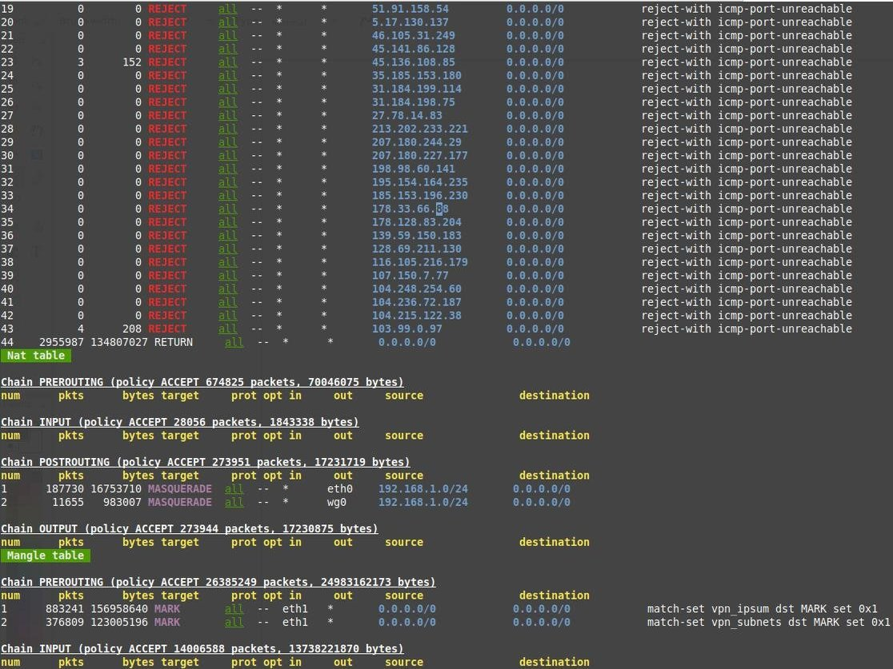
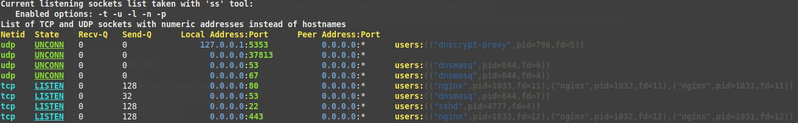

# linux_cli_tools

Tiny Linux CLI helpers in daily work.

### **ipt** - Colorizing your iptables output

`ipt` - colored and easy to read output of `iptables` rules from all tables.

Example output of `ipt`:

### **sss** - Colorizing your `ss` output

 * `ss` is the [iproute2](https://en.wikipedia.org/wiki/Iproute2) suite replacement of the deprecated `netstat` Linux networking command.

`sss` - colored and easy to read output of `ss` tool that shows all listening ports on linux machine.

Example output of `sss`:

